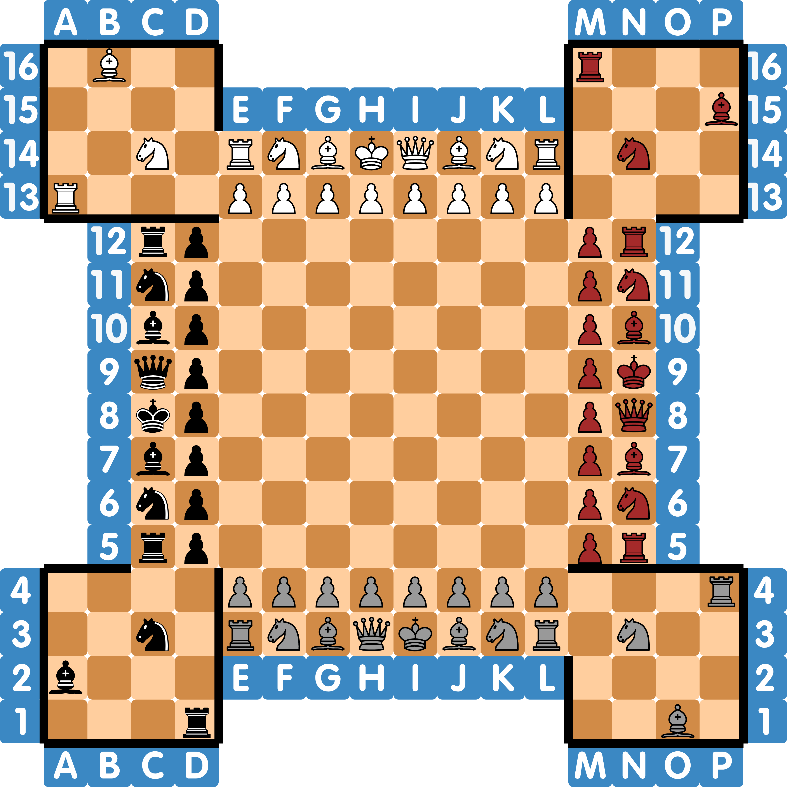

# 4chess-fortress
<sub>The 4 Player Chess - Fortress Variant</sub>

This implements the logic for Fortress Chess as described by [Wikipedia](https://en.wikipedia.org/wiki/Fortress_chess) (for more detail, check the german version).

Specialties of this chess variant:
- **Team game**: Players opposite of each other are teammates.
- **Queen with additional movement**: The Queen can now also move like a horse.
- **Fortress**: In the four corners of the board exists a fortress with reserve troops. The drawn in wall can't be crossed.
- **Freeze**: If a player is checkmated, they're merely frozen until they're either rescued or the whole team is checkmated.
- **Promotion**: Unlike the mentioned rule that promotion is only available at the other side of the board (or the first rank of the enemy pieces) this implementation allows promotion on every field after the 8th rank of every respective color (e.g. black can start promoting with the `J` file, grey can start promoting with the 10th rank), all the way until the end (including the fortresses). \
Should you prefer the official promotion rule you can simply change the allowed promotion squares in `Board.get_pawn_promotion_rank` to `N12` - `N05`, `E14` - `L14` and `E3` - `L03`

\
Starting position:



## Getting Started
1. create an instance of `Board` (following named `board`)
2. create a game loop
   1. create an instance of `Move` (following named `move`)
   2. verify if it's valid with `board.is_valid(move)`, this will return a `(success: bool, reason: str)` tuple
      1. the reasons `CheckErrorMsg.CheckmateTeammate` and `CheckErrorMsg.CheckmateYourself` are intended as warnings and should have an ignore event implemented
   3. execute the move with `board.move(move)` or use `board.pop()` to undo the last move
   4. if `board.winner` is set, the game is over.

## Extras:
- `board.turn` returns the color of the player for the next turn
- `Move.possible_legal_moves_color(board: Board, color: str)` to get a list of legal moves for a given color
- `board.checked` is a `{str: bool}` map for colors to see if they're currently checked, `board.frozen` for currently checkmated players
- `board.layout` is a 1D list of `Square`s representing the 16x16 game board, mirrored horizontally. The empty regions (A12-A5, B12-B5, etc.) are `None` \
  use `board.get_square(square: int | Square | str)` to interact with it instead. `str` is the normal text notation: e.g. "E5" and `int` is a direct index.
- `board.graveyard` is a list of all pieces that were removed from the game board
- `board.move_stack` is a list of all played `Move`s, which may help in noting or undoing a move
- `Board.COLORS` and `Board.TEAMS` are class constants that contain the colors in order and their respective teammates
  - `COLORS = ("white", "brown", "grey", "black")`
  - `TEAMS = (("white", "grey"), ("brown", "black"))`
- `board.next_turn(n=1)` to skip `n` turns

\
I recommend to add a game dump in case of Exceptions. You'd need to save `board.layout`, `board.turn`, `board.graveyard`, `board.castling_rights`, your separate list of players and optionally `board.move_stack` if you want to undo past loading this dump. Example code using `PyYAML`, but `json` would also work:
```py
def game_dump(board: Board): 
    return yaml.safe_dump(([a.position+('-'+Piece.to_initial(a.piece_at.type)+'|'+a.piece_at.color if a.piece_at else '') if isinstance(a, Square) else None for a in board.layout],
                           board.turn,
                           [Piece.to_initial(a.type)+'|'+a.color for a in board.graveyard],
                           # <player list>,
                           board.castling_rights,
                           # <optionally board.move_stack>
                         ))
def game_load(dump: str, board: Board):
    load = yaml.safe_load(dump)
    board.layout.clear()
    board.layout.extend([Square(a.split("-", 1)[0], Piece(*a.split("-", 2)[1].split("|")) if len(a.split("-")) == 2 else None) if a is not None else None for a in load[0]])
    board.turn = load[1]
    board.graveyard.clear()
    board.graveyard.extend([Piece(*a.split("|")) for a in load[2]])
    board.castling_rights.clear()
    board.castling_rights.update(load[4])
    board.check_checks()
    board.update_frozen()
```