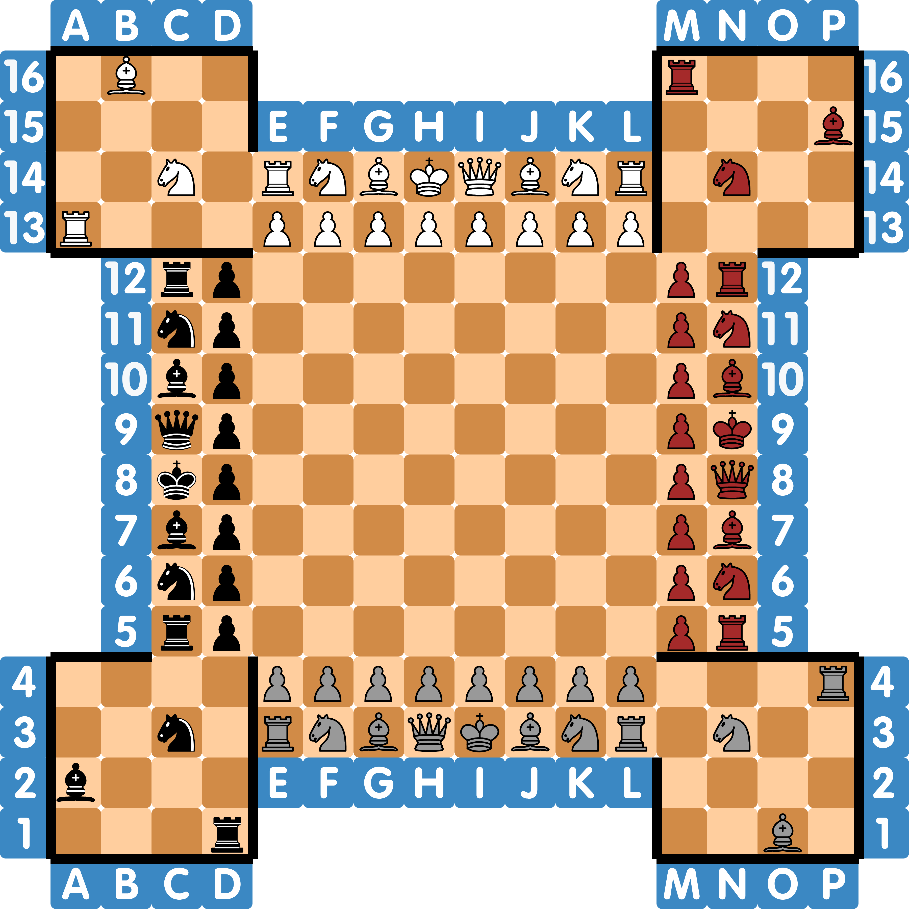

# 4chess-fortress
The 4 Player Chess - Fortress Variant

This implements the logic for Fortress Chess as described by [Wikipedia](https://en.wikipedia.org/wiki/Fortress_chess) (for more detail, check the german version).

Specialties of this chess variant:
- **Team game**: Players opposite of each other are teammates.
- **Queen with additional movement**: The Queen can now also move like a horse.
- **Fortress**: In the four corners of the board exists a fortress with reserve troops. The drawn in wall can't be crossed.
- **Freeze**: If a player is checkmated, they're merely frozen until they're either rescued or the whole team is checkmated.
- **Promotion**: Unlike the mentioned rule that promotion is only available at the other side of the board (or the first rank of the enemy pieces) this implementation allows promotion on every field after the 8th rank of every respective color (e.g. black can start promoting with the `J` file, grey can start promoting with the 10th rank), all the way until the end (including the fortresses). \
Should you prefer the official promotion rule you can simply change the allowed promotion squares in `Board.get_pawn_promotion_rank` to `N12` - `N05`, `E14` - `L14` and `E3` - `L03`

\
Starting position:

